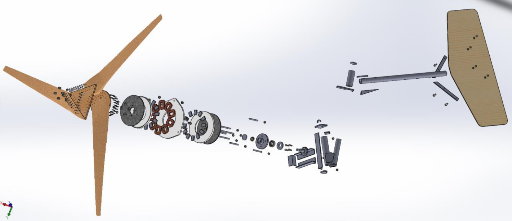
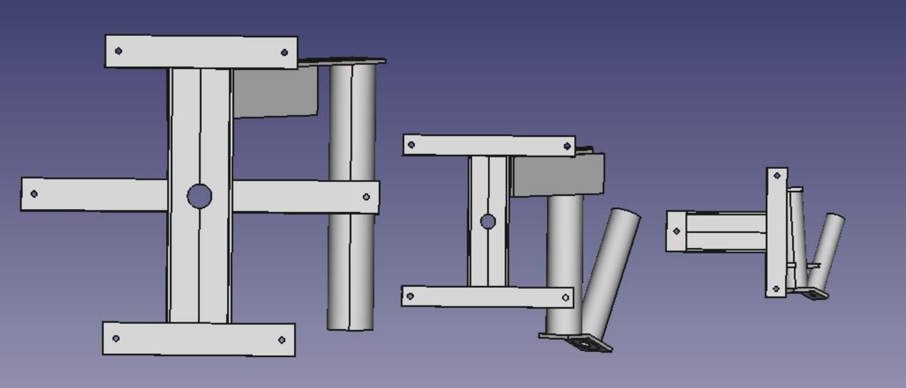
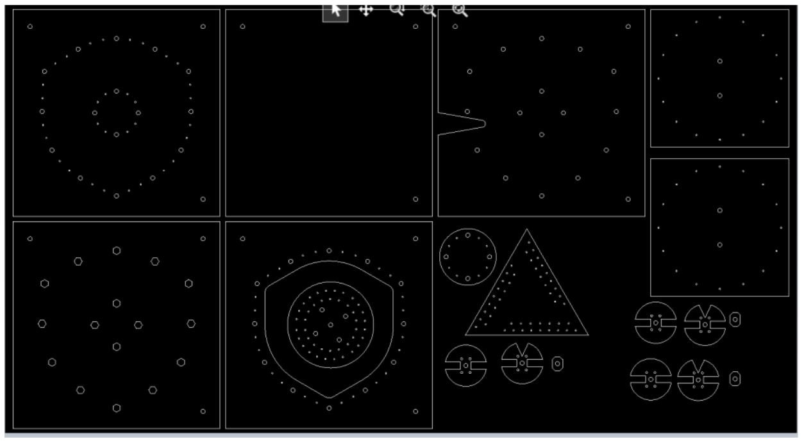
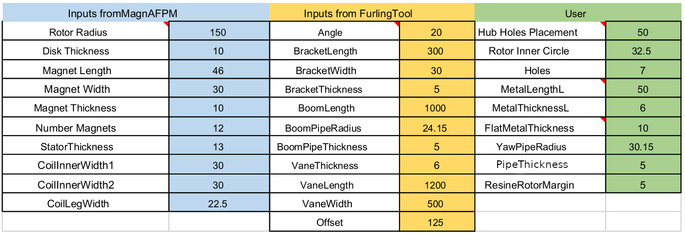

OpenAFPM CAD Core
=================
Locally Manufactured Small Wind Turbines.

Due to the mechanical strength of the materials, the model is limited to wind turbines smaller than 10m in diameter -- the diameter swept by the blades

Three main goals:

1. Recipe Generation (see ``Spreadsheet Recipe.xlsx``)
2. Visualization
3. Export for Laser Cutting

A wind turbine is made up of 3 main parts:

1. the `tower <https://en.wikipedia.org/wiki/Wind_turbine_design#Tower>`_
2. the `nacelle <https://en.wikipedia.org/wiki/Nacelle_(wind_turbine)>`_ containing the alternator
3. and the blades

The tower and blades are not included in the model.

Thus, the parameterized model includes three major parts:

1. The `alternator <https://en.wikipedia.org/wiki/Wind_turbine_design#Generator>`_, composed of 2 rotors with permanent magnets bonded to steel discs and a stator made of coils fixed in resin.
2. **Nacelle**, composed of different metal parts supporting the alternator and a hub allowing the rotation of the rotors.
3. `Tail <https://en.wikipedia.org/wiki/Wind_turbine_design#Yawing>`_ and `vane <https://en.wikipedia.org/wiki/Weather_vane>`_, allowing the wind turbine to be oriented into the wind and acting as mechanical protection (furling) in the event of strong winds.

Three main variants from smallest to largest:

+------------+----------------+-------------------+-----------------+
| Variant    | Rotor Radius   | Attachment Points | Number of Coils |
+============+================+===================+=================+
| T Shape    | 0 - 187.5 mm   | 3                 | 9 (6)           |
+------------+----------------+-------------------+-----------------+
| H Shape    | 187.5 - 275 mm | 4                 | 12              |
+------------+----------------+-------------------+-----------------+
| Star Shape | > 275 mm       | 6                 | 24              +
+------------+----------------+-------------------+-----------------+

We can observe the different parts (from left to right):

1. The blades
2. Then the 1st rotor

  a. Metal disc
  b. Resin disc (in white)
  c. and the 12 magnets

3. Followed by the stator

  a. 9 coils
  b. and the resin

4. Then the 2nd rotor
5. Followed by the hub (with the rocket) hanging on the metallic structure.
6. Finally, to the top right is the tail and vane.



   T Shape 2m40 Wind Turbine

Note, the stator is hooked to the ends of the nacelle via 3 attachment points, and the
rotors are attached to the nacelle via the hub, which allows rotation (rod bearing).
The hub is itself fixed in the middle of the nacelle.



   From right to left, nacelles for Star Shape, H Shape, and T Shape.

The wind turbine's parts are divided into the following categories:

1. **Rotor**

  a. Metal disc, magnets, resin and molds

2. **Stator**

  a. Coils, resin and molds

3. **Nacelle**

  a. 3 to 6 metal parts which will support the alternator
  b. 1 tube connected to the tower
  c. 1 tube connected to the rudder
  d. 2 parts which define the lever arm between the alternator and the tower

4. **Tail and vane**

  a. Wooden plate
  b. 1 tube acting as a lever arm
  c. 1 tube connecting to the Nacelle
  d. Carious parts to hold everything
  e. 2 stops to limit the rotation of the rudder on its axis

5. **Coil Winder** (tool to make the coils to the right dimensions)

  a. 2 wooden discs
  b. One piece between the two wooden discs
  c. 4 nails holding the whole thing together
  d. and a metal rod allowing rotation

Differences Between H Shape and T Shape
---------------------------------------
Compared to the T Shape, the stator and the nacelle are modified.
Indeed the stator, more imposing needs 4 anchor points, the shape of the nacelle follows.
The hub is larger and the rotors have 5 fixing points instead of 4.

Stator has 12 coils instead of 9.

Star Shape
----------
Not part of Hugh Piggott's *A Wind Turbine Recipe Book*, but several have been built by actors in the Wind Empowerment
network.

Largest to date is 7m in diameter.

Coil Winder
-----------
3 kinds of coil shapes:

1. Rectangular
2. Trapezoidal
3. Triangular

The most important piece is the middle piece connecting the two wooden discs.
It defines the shape of the coils as well as their thickness.
This part is entirely defined by the inputs and depends on the type of coil and the size of the magnets.

See `OpenAFPM: Design Tips <https://openafpm.net/design-tips>`_ for more information.

Tail and Vane
-------------
* The same for the 3 variants.
* Defined by inputs which come from the tool "the Furling Tool"

For larger wind turbines (Star Shape) a second pipe is needed to support the tail.

.. figure:: tail-hinge.png
   :align: center

   Tail Hinge

The 20° angle must be taken into account in the creation and assembly.
It is an input (therefore variable) and influences the mechanical brake exerted by the rudder.
Generally, for a alternator with neodymium magnets, it will be 20°.
For ferrite magnets, it is about 13°, which tends to reduce the torque of the rudder.

Laser Cutting
-------------
All the wooden and metal parts can be pre-cut with a laser.
Laser cutting, despite increasing financial cost, halves construction time.
Export all the parts in the DXF format and group them into a single file.



   DXF File for Laser Cutting

Inputs
------
A total of 30 inputs is needed for the parameterized model:

* 10 from MagnAFPM
* 11 from the Furling Tool
* 9 user parameters.



   Inputs

User Inputs
-----------
User inputs correspond to the characteristics of metal parts such as the various steel tubes, brackets, and bars used.
All these inputs have default values which depend on the variant of wind turbine.
These are standard values of metal parts found everywhere.
However, the user has the possibility during the sizing process to change these values by those of the material available.


Spreadsheet Recipe to MagnAFPM Variable Mapping
------------------------------------------------
=================== =========================
Spreadsheet         MagnAFPM
=================== =========================
``RotorRadius``     ``Rout``
``MagnetLength``    *Input Parameter*
``NumberMagnets``   ``magnet_num``
``MagnetThickness`` *Input Parameter*
``StatorThickness`` ``tw``
``CoilLegWidth``    ``wc``
``CoilInnerWidth1`` ``coil_hole_Rout_constr``
``CoilInnerWidth2`` ``coil_hole_Rin_constr``
=================== =========================

Meta Part Parameters
--------------------

Rotor Mold
^^^^^^^^^^
1. ``RotorRadius`` (MagnAFPM)
2. ``ResineRotorMargin`` (User)
3. ``HubHolesPlacement`` (User)

  a. Default value uses ``RotorRadius``

4. ``MagnetLength`` (MagnAFPM)
5. ``NumberMagnets`` (MagnAFPM)
6. ``MagnetThickness`` (MagnAFPM)

Stator Mold
^^^^^^^^^^^
1. ``StatorThickness`` (MagnAFPM)
2. ``RotorRadius`` (MagnAFPM)
3. ``MagnetLength`` (MagnAFPM)
4. ``CoilLegWidth`` (MagnAFPM)

Coil Winder
^^^^^^^^^^^
1. ``MagnetLength`` (MagnAFPM)
2. ``CoilInnerWidth1`` (MagnAFPM)
3. ``CoilInnerWidth2`` (MagnAFPM)

Import Part libexpat Seg Fault
------------------------------
```
importing part from /home/g/proj/wind-turbine/Parametrized Design Piggot Windturbine/FreecadFiles/T Shape ( RotorRadius 0 - 187.5mm )/Metal Pieces/Cable holder.FCStd
Program received signal SIGSEGV, Segmentation fault.
#0  /lib/x86_64-linux-gnu/libc.so.6(+0x46210) [0x7ff3df3ec210]
#1  /lib/x86_64-linux-gnu/libexpat.so.1(XML_SetHashSalt+0x10) [0x7ff3d7299d00]
#2  /tmp/.mount_FreeCAU5fT7C/usr/lib/python2.7/lib-dynload/pyexpat.x86_64-linux-gnu.so(+0x3e32) [0x7ff3642a2e32]
#3  /tmp/.mount_FreeCAU5fT7C/usr/lib/x86_64-linux-gnu/libpython2.7.so.1.0(PyEval_EvalFrameEx+0x4bd4) [0x7ff3e0aa00d4]
```
https://forum.freecadweb.org/viewtopic.php?t=32338#p269788
https://forum.freecadweb.org/viewtopic.php?t=26940#p215302
wmayer explanation:
https://forum.freecadweb.org/viewtopic.php?f=3&t=26291&start=10#p208769

https://packages.ubuntu.com/xenial-updates/amd64/libexpat1/download
https://packages.ubuntu.com/xenial/amd64/libexpat1-dev/download
```
wget http://security.ubuntu.com/ubuntu/pool/main/e/expat/libexpat1-dev_2.1.0-7ubuntu0.16.04.5_amd64.deb
wget http://mirrors.kernel.org/ubuntu/pool/main/e/expat/libexpat1_2.1.0-7ubuntu0.16.04.5_amd64.deb
sudo dpkg -i *.deb
```

Installing Package
------------------
From ``~/.FreeCAD/Mod``:

.. code-block::

   ln -s path/to/openafpm-cad-core/ openafpm-cad-core


Installing Test Macro
---------------------
From ``~/.FreeCAD/Macro``:

.. code-block::

   ln -s path/to/openafpm-cad-core/test.py test.py


WebGL
-----
* https://wiki.opensourceecology.org/wiki/WebGL
* https://threejsfundamentals.org/threejs/lessons/threejs-transparency.html

Links
-----
* `Open AFPM - Online Design Tools for Locally Manufactured Small Wind Turbines <https://www.openafpm.net/>`_
* `[YouTube] Wind Empowerment Webinar - OpenAFPM tools for designing AFPM generators for Small Wind Turbines <https://www.youtube.com/watch?v=hk0j-qxkG9s&ab_channel=WindEmpowerment>`_
* `Wind Empowerment <https://windempowerment.com/>`_
* `WISIONS of Sustainability <https://wisions.net/>`_
* `Hugh Piggott's blog <http://scoraigwind.co.uk/>`_

  * `A Wind Turbine Recipe Book (metric edition) by Hugh Piggott <http://scoraigwind.co.uk/pdf-metric-edition-of-recipe-book-at-scribd/>`_

* `[Wikipedia] Wind turbine design <https://en.wikipedia.org/wiki/Wind_turbine_design>`_

Related Repositories
--------------------
* `openafpm-cad-visualization <https://github.com/gbroques/openafpm-cad-visualization>`_